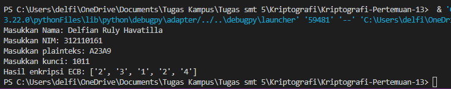

## Profil
**_<p>Nama: Delfian Ruly Havatilla</p>_**
**_<p>Kelas: TI.21.A.1</p>_**
**_<p>Nim: 312110161</p>_**

## Pengertian ECB (Electronic Codebook)
<p>ECB (Electronic Codebook) adalah salah satu mode operasi dalam kriptografi blok yang digunakan untuk mengenkripsi dan mendekripsi data. Mode ECB memproses blok-blok data secara independen satu sama lain, tanpa memperhatikan hubungan antara blok-blok tersebut. Setiap blok dienkripsi terpisah dengan menggunakan kunci yang sama.<p>

## Input Nama dan NIM:
```py 
nama = input("Masukkan Nama: ")
nim = input("Masukkan NIM: ")
```

## Konkatenasi Nama dan NIM:
```py
data = nama + nim
```
<p>Menggabungkan nama dan NIM menjadi satu string.<p>

## Fungsi `encrypt_ecb`
- Step 3: Mengonversi plainteks dari format heksadesimal ke biner.
```py
def encrypt_ecb(plaintext_hex, key_bin):
    # Step 3: Rubah plainteks hexadecimal ke biner
    plaintext_bin = bin(int(plaintext_hex, 16))[2:]
```
- Step 4: Memisahkan biner plainteks menjadi blok-blok berukuran 4 bit.
```py    
    # Step 4: Pisah per blok 4 bit sesuai panjang blok
    block_size = 4
    plaintext_blocks = [plaintext_bin[i:i+block_size] for i in range(0, len(plaintext_bin), block_size)]
```
- Step 5: Melakukan operasi XOR antara biner plainteks dan kunci.
```py
 # Step 5: XOR-kan biner plainteks per blok dengan kunci
    encrypted_blocks = []
    for block in plaintext_blocks:
        xor_result = bin(int(block, 2) ^ int(key_bin, 2))[2:].zfill(block_size)
```
- Step 6: Melakukan pergeseran satu bit ke kiri pada hasil XOR.
```py
# Step 6: Geser tiap blok 1 bit ke kiri
        shifted_result = xor_result[1:] + xor_result[0]
```
- Step 7: Mengonversi hasil pergeseran XOR ke format heksadesimal dan menyimpannya dalam bentuk array.
```py
# Step 7: Hasil XOR konversi ke hexadecimal
        encrypted_blocks.append(hex(int(shifted_result, 2))[2:].upper())

    return encrypted_blocks
```

## Hasil


## Catatan
- Implementasi ini adalah contoh sederhana dari enkripsi ECB dan mungkin tidak sesuai untuk penggunaan praktis karena kelemahan keamanan tertentu yang terkait dengan mode ini.
- Pertimbangkan untuk menggunakan mode enkripsi yang lebih aman seperti CBC (Cipher Block Chaining) dengan penggabungan vektor inisialisasi (IV).
